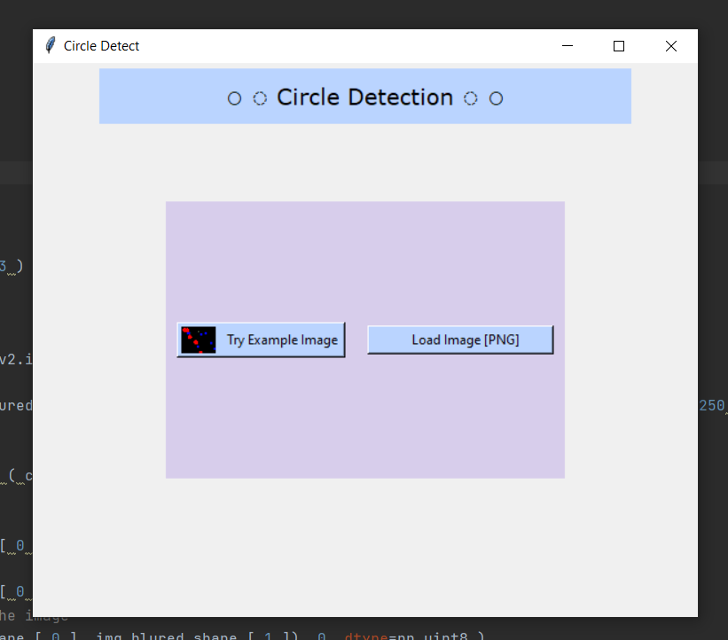

<!DOCTYPE html>
<h1 align="center"> Circle Detection with OpenCV and Python <h1/>
<h2 align="center"> 📚  Library : tkinter , cv2  </h2>

It detects the circles in the uploaded photo .
Or you can try the sample photo.

